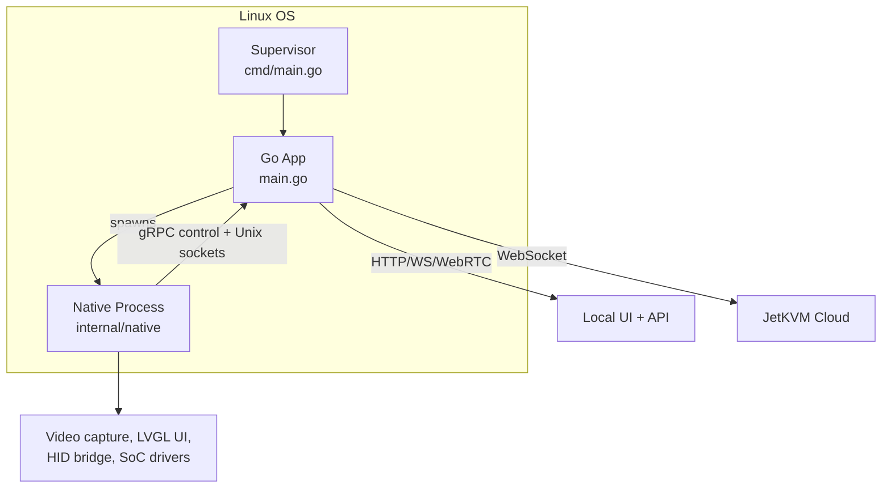
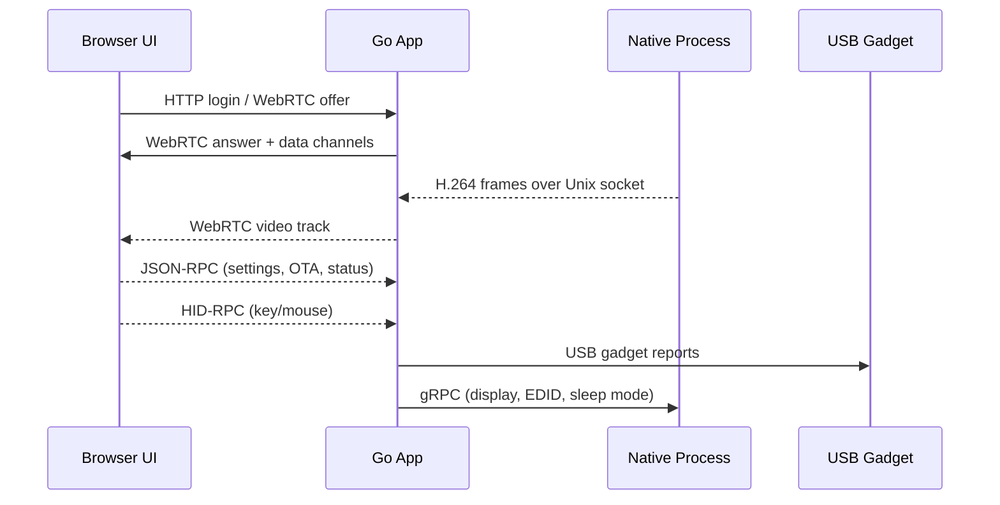

# JetKVM Architecture (OS + Go)

This document focuses on how the JetKVM device software is structured on Linux and how the Go runtime coordinates device services, video capture, and remote control.

## Process Model
The firmware runs a supervising wrapper that spawns the main app and (separately) a native process that handles hardware-intensive work.

- The supervisor validates the executable and re-execs the binary with a child ID, capturing crash logs under `/userdata/jetkvm/crashdump` (`cmd/main.go`, `internal/supervisor`).
- The app process (`kvm.Main`) initializes config, watchdog, network, native proxy, display, OTA, and servers.
- The native process is launched by the app when hardware acceleration is needed and communicates over Unix sockets.

## Startup Sequence (Go App)
Key initialization stages (in order, from `main.go`):
1. Load configuration from `/userdata/kvm_config.json` with defaults + validation (`config.go`).
2. Start the watchdog loop writing to `/dev/watchdog` (`hw.go`).
3. Initialize USB gadget emulation for keyboard/mouse/storage (`usb.go`, `internal/usbgadget`).
4. Spin up the native proxy and on-device display updates (`native.go`, `display.go`).
5. Initialize network manager, mDNS, time sync, and OTA state (`network.go`, `mdns.go`, `timesync.go`, `ota.go`).
6. Start HTTP servers, WebRTC session handling, and cloud WebSocket client (`web.go`, `webrtc.go`, `cloud.go`).

## Native Subsystem (Hardware-Heavy Path)
The native process is responsible for video capture/encode and on-device LVGL UI. It is launched by `internal/native.NewNativeProxy`, which:
- Spawns the same binary with `JETKVM_SUBCOMPONENT=native`.
- Creates a gRPC control socket for commands (EDID, display rotation, UI updates).
- Creates a Unix socket for a raw video frame stream.
- Sends a handshake message to the parent over stdout before accepting commands.

The app process writes received frames into a WebRTC video track (`native.go` → `webrtc.go`). If native crashes repeatedly, failsafe mode swaps in a no-op native interface (`failsafe.go`).

## Control and Data Flows
The remote UI establishes WebRTC for video + control. JSON-RPC is layered on WebRTC data channels for device actions (config, power, video settings, etc.). HID input is encoded via a HID-RPC protocol and routed to the USB gadget.

## Web / API Layer
- **Local UI + API:** `web.go` uses Gin to serve the SPA and REST endpoints for auth/setup/device status. Static UI assets are embedded and served from `static/`.
- **Session Control:** `webrtc.go` creates the peer connection and data channels; `jsonrpc.go` dispatches RPC methods.
- **Cloud:** `cloud.go` maintains an outbound WebSocket to JetKVM Cloud for remote access when configured.
- **TLS:** Optional HTTPS server (`web_tls.go`) for local secure access.

## Network and Time
`network.go` wraps `pkg/nmlite` to configure `eth0`, DHCP, and routing. Network state changes trigger:
- mDNS updates (`internal/mdns`).
- NTP resync (`timesync.go`).
- Public IP readiness checks for cloud usage.

## Configuration and State
- Primary configuration file: `/userdata/kvm_config.json`.
- Crash logs: `/userdata/jetkvm/crashdump/` with a `last-crash.log` symlink.
- OTA updates are handled via the update API and can be triggered by JSON-RPC (`ota.go`).

## Observability
- Prometheus metrics are exposed at `/metrics` (`prometheus.go`).
- Developer-mode routes expose pprof and a log SSE stream (`web.go`, `internal/logging`).
- App logs are written to stdout/stderr and collected by the supervisor.

## Key Architectural Boundaries
- **App vs. Native:** Go app owns orchestration; native owns performance-critical media and on-device UI.
- **Local vs. Cloud:** Local HTTP/WS endpoints work without cloud; cloud uses an outbound WebSocket + WebRTC.
- **OS vs. App:** Go touches Linux interfaces directly (`/dev/watchdog`, `/sys/class/backlight`, USB gadget) while higher-level logic lives in Go packages.
