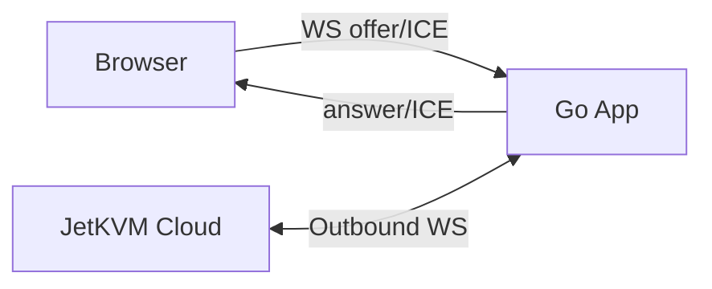
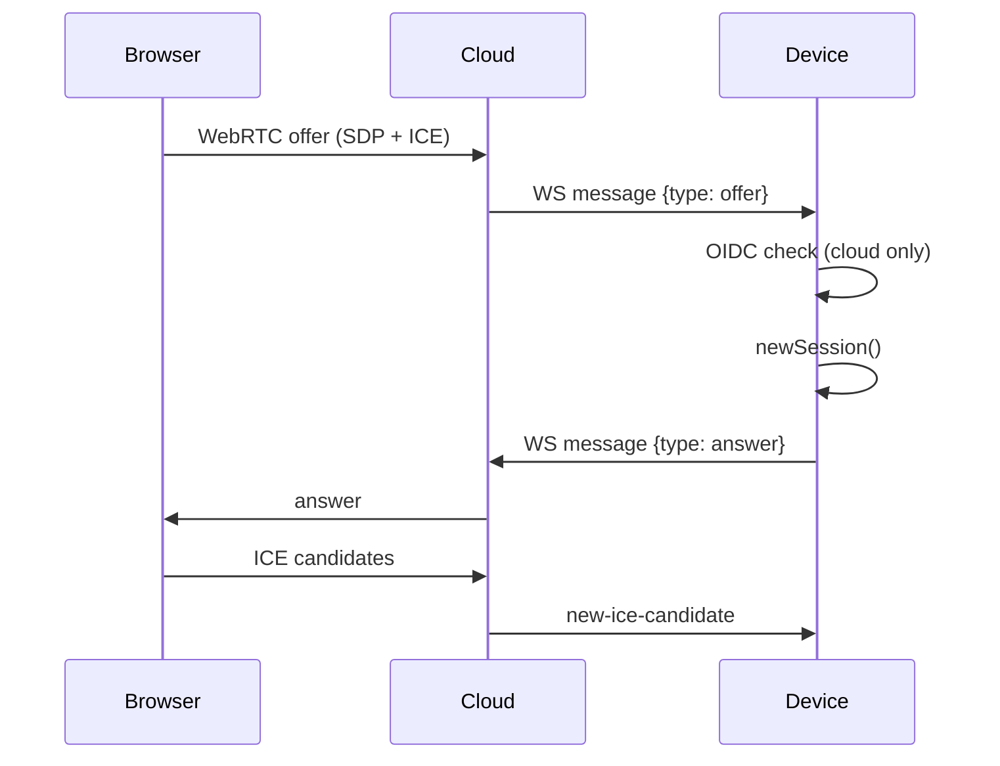

# Cloud Signaling and WebRTC Session Setup

This document explains how JetKVM establishes WebRTC sessions through local and cloud signaling paths.

## Signaling Paths
JetKVM supports two signaling modes that share the same WebRTC session creation logic:
- **Local signaling**: browser connects to `/webrtc/signaling/client` over WebSocket on the device.
- **Cloud signaling**: device maintains an outbound WebSocket to JetKVM Cloud.

## Local Signaling Flow
1. Browser opens a WebSocket to `/webrtc/signaling/client` (`web.go`).
2. Device replies with `device-metadata` (app version).
3. Browser sends an `offer` message containing WebRTC SDP.
4. Device calls `handleSessionRequest` to create a session and replies with an `answer`.
5. ICE candidates are exchanged via `new-ice-candidate` messages.

## Cloud Signaling Flow
1. Device opens an outbound WebSocket to the cloud URL (wss) with headers:
   - `X-Device-ID`, `X-App-Version`, `Authorization: Bearer <token>`.
2. The same WebSocket message loop (`handleWebRTCSignalWsMessages`) receives `offer` and `new-ice-candidate` messages.
3. If the offer includes `OidcGoogle`, the device verifies it against Google OIDC and the stored `config.GoogleIdentity`.
4. The session is created and the `answer` is sent over the same WebSocket.

## Session Construction Details
- `newSession` sets up a Pion WebRTC peer connection with optional ICE servers from the cloud offer.
- When a local IP is provided by the cloud, it is used as a NAT1To1 IP for srflx candidates.
- The session creates data channels for RPC, HID, and terminal features and sets up a video track (H.264).
- If a new session is accepted, the previous session is closed after a short delay.

## Connection Health and Metrics
- The signaling socket sends periodic pings; pongs update Prometheus metrics.
- Connection state transitions update UI status and cloud connection state.
- Cloud disconnects trigger a cleanup path via `cloudDisconnectChan`.

## Legacy Signaling
A legacy HTTP endpoint (`/webrtc/session`) remains for backward compatibility during upgrades.
