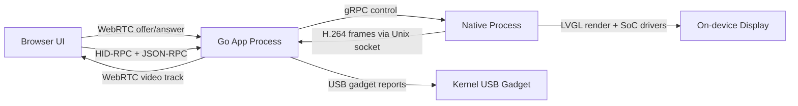
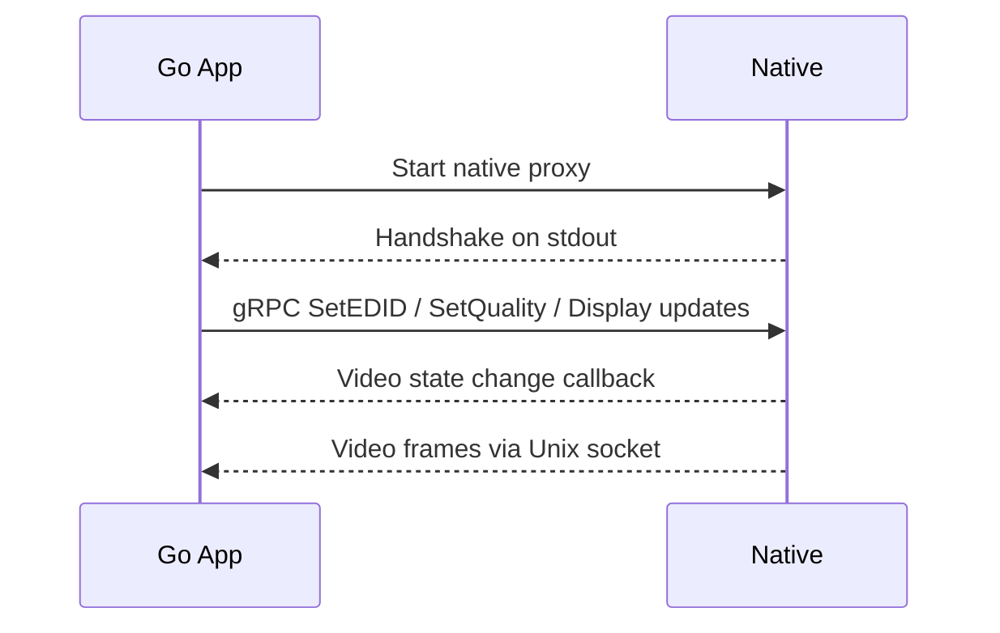

# Native Media Pipeline

This document describes how JetKVM captures video, routes input, and updates the on-device UI by coordinating the Go app with the native process.

## High-Level Topology

## Video Capture and Streaming
1. The app starts the native proxy (`native.go`), which spawns the same binary with `JETKVM_SUBCOMPONENT=native`.
2. The native process opens a Unix socket for video frames and a gRPC control socket (`internal/native`).
3. Video frames are pushed from native to the parent over the Unix socket with a 4-byte length prefix (`internal/native/server.go`).
4. The app writes frames into a WebRTC `TrackLocalStaticSample` using H.264 (`webrtc.go`).
5. When the first session connects, video starts (`onFirstSessionConnected`), and when the last session disconnects, video stops and a sleep timer resumes.

## Control Plane (App to Native)
The app uses gRPC calls via the native proxy to control video and UI state:
- EDID updates, sleep mode, and quality factor changes.
- Display rotation and LVGL UI object updates for the on-device screen.
- Native process emits callbacks (video state changes, RPC events, input device events).

## Input and HID Pipeline
- The browser sends HID-RPC and JSON-RPC over WebRTC data channels.
- The app decodes HID-RPC (`internal/hidrpc`) and forwards input to the USB gadget (`internal/usbgadget`).
- USB gadget state changes are reported back to the active session to keep UI state in sync.

## On-Device Display Updates
`display.go` uses the native interface to update LVGL widgets with current status:
- Network and USB states, HDMI connection, cloud status, and active session count.
- A display update lock prevents concurrent updates from racing.

## Failure Handling and Failsafe
If native crashes repeatedly or fails to initialize, the app switches to an empty native interface (`failsafe.go`). This disables hardware-dependent features while keeping the device reachable and controllable through the Go app and local web UI.
