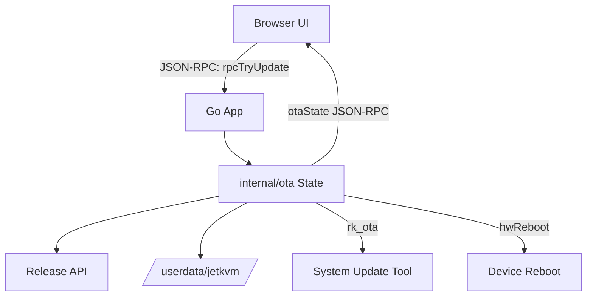

# OTA Update Flow

This document describes the over-the-air (OTA) update pipeline implemented in the Go app and the `internal/ota` package.

## Overview
JetKVM maintains two updatable components: `app` (the Go binary) and `system` (the OS image). Updates are discovered via the release API and executed on-device with download, verification, and a controlled reboot.

## Discovery and Status
- Release metadata is fetched from `config.GetUpdateAPIURL()` with query params: `deviceId`, `prerelease`, and optional component version constraints (`internal/ota/ota.go`).
- Local versions are read from the built app version and `/version` on the filesystem (`ota.go`).
- The OTA state tracks per-component availability and progress fields, surfaced via `otaState` JSON-RPC events.

## Update Execution
### App Update
- Downloaded to `/userdata/jetkvm/jetkvm_app.update`.
- Written as `*.unverified`, then SHA256 verified and renamed.
- File is marked executable after verification.

### System Update
- Downloaded to `/userdata/jetkvm/update_system.tar` and verified.
- Applied with `rk_ota` using the `--tar_path` and `--partition=all` flags.
- Progress is incremented during `rk_ota` execution and finalized on success.

### Reboot and Post-Reboot Action
- If any component update succeeds, `hwReboot` is invoked with a short delay.
- If `ResetConfig` was requested, configuration is reset before reboot and the UI is redirected to the welcome flow.
- A post-reboot action includes a health check URL (`/device/status`) and redirect target.

## Auto-Update Behavior
- The main loop periodically checks for updates when auto-update is enabled and no session is active (`main.go`).
- Custom version updates disable auto-update after a successful update to avoid surprise upgrades.

## Key Files and Paths
- Update metadata and logic: `internal/ota/*.go`
- App update file: `/userdata/jetkvm/jetkvm_app.update`
- System update file: `/userdata/jetkvm/update_system.tar`
- OS version file: `/version`
