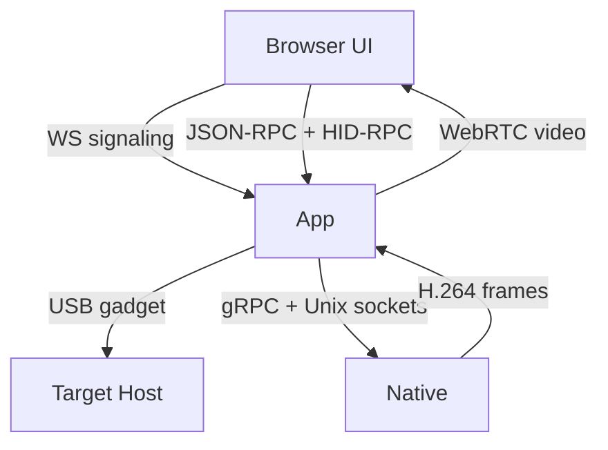

# Concept of Operations (CONOPS)

This document provides a high-level operational view of the JetKVM firmware and maps major features to the key files in this repository. It is intended for teams adapting the stack to a custom RV1106G board.

## Mission Summary
JetKVM runs a Go application on Linux that:
- Captures HDMI video and forwards it over WebRTC.
- Emulates keyboard/mouse/USB mass storage to the target host (USB gadget).
- Serves a local web UI and optionally connects to JetKVM Cloud.
- Manages device config, updates (OTA), and on-device status UI.

A separate native process handles performance-critical video and LVGL display work and is controlled by the Go app over local IPC.

## Process Model
- **Supervisor + App**: `cmd/main.go` validates the binary and spawns the main app (`kvm.Main` in `main.go`).
- **Native subcomponent**: the same binary is re-executed with `JETKVM_SUBCOMPONENT=native` and runs `internal/native/server.go`.

## Primary Operational Flow
1. **Boot / Start**
   - Load configuration from `/userdata/kvm_config.json` (`config.go`).
   - Start watchdog (`hw.go`) and check failsafe state (`failsafe.go`).
2. **Hardware init**
   - Start USB gadget subsystem (`usb.go`, `internal/usbgadget`).
   - Start native proxy and display updates (`native.go`, `display.go`).
3. **Networking**
   - Initialize network manager (`network.go`), mDNS (`mdns.go`), and time sync (`timesync.go`).
4. **Services**
   - Start local HTTP/WS servers (`web.go`, `web_tls.go`).
   - Start WebRTC session handling (`webrtc.go`) and cloud websocket client (`cloud.go`).
5. **Run loop**
   - Serve UI, accept sessions, stream video, and process input.
   - Periodically check for OTA updates (`ota.go`, `internal/ota`).

## Core Subsystems and File Map
### Video capture and streaming
- **Native video + LVGL UI**: `internal/native/*`, `internal/native/cgo/*`, `internal/native/eez/*`
- **App-side video pipeline**: `native.go`, `video.go`, `webrtc.go`
- **Session lifecycle**: `webrtc.go` (tracks, data channels, connect/disconnect)

### Input / HID / USB gadget
- **USB gadget initialization**: `usb.go`, `internal/usbgadget/*`
- **HID-RPC parsing**: `hidrpc.go`, `internal/hidrpc/*`
- **RPC fallbacks for input**: `jsonrpc.go` (keyboard/mouse methods)

### Web UI + API
- **HTTP + REST**: `web.go` (auth, setup, device status, metrics)
- **TLS server**: `web_tls.go`
- **Static UI assets**: `static/` (built from `ui/`)

### Cloud connectivity
- **WebSocket to Cloud**: `cloud.go`
- **Shared signaling loop**: `web.go` (`handleWebRTCSignalWsMessages`)

### Virtual media (mount ISO/IMG)
- **USB mass storage**: `usb_mass_storage.go`
- **NBD bridge for HTTP images**: `block_device.go`, `block_device_linux.go`

### OTA updates
- **App-level wiring**: `ota.go`
- **Implementation**: `internal/ota/*`

### Device extensions and power
- **Serial/ATX/DC extensions**: `serial.go`
- **Wake-on-LAN**: `wol.go`

### Observability and safety
- **Logging**: `log.go`, `internal/logging/*`
- **Prometheus**: `prometheus.go`
- **Failsafe**: `failsafe.go`

## Control and Data Planes (Simplified)

## Custom Board Adaptation Notes (RV1106G)
- **Native layer** is the primary hardware integration point:
  - Video capture/encode and display are in `internal/native/cgo/*` and related native code.
  - LVGL project assets are under `internal/native/eez/`.
- **Device I/O** paths are hard-coded in places (examples):
  - `/dev/watchdog` (`hw.go`)
  - `/dev/ttyS3` serial extension (`serial.go`)
  - `/sys/class/backlight/...` display brightness (`display.go`)
  - `/dev/nbd0` NBD virtual media (`block_device.go`)
- **USB gadget behavior** is driven by `internal/usbgadget` and the config file. You may need to adjust gadget descriptors and default configs for your board.
- **Networking** assumes an `eth0` interface (`network.go`). Adjust if your board uses a different interface name.

## Main Logic Entry Points
- `cmd/main.go` -> supervisor, subcomponent dispatch
- `main.go` -> application initialization and long-running services
- `webrtc.go` -> session creation, data channels, video track
- `jsonrpc.go` -> device control surface and RPC registry
